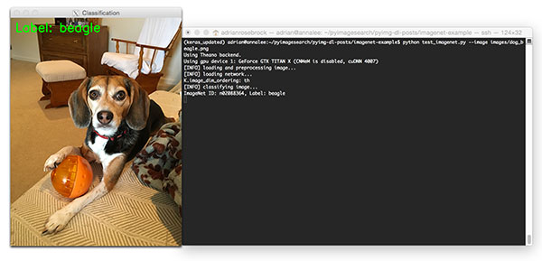
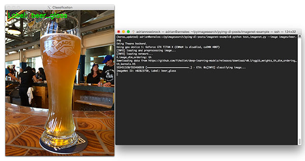

# object-recognizer
A script to classify objects from ImageNET.

# Dependencies
* Python 2.7
* OpenCV 2.4+
* keras
* pillow

# Running
<code>python main.py -i myimage.jpg</code>
# Author
Nahom Abi
